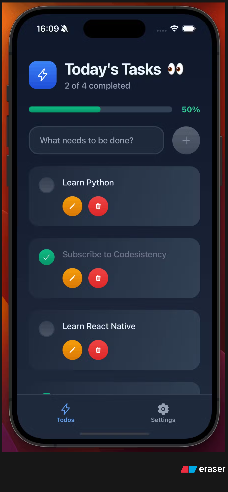

# Todo App



## Overview

Todo App is a simple and efficient task management application designed to help you organize your daily activities.

## Features

- Add, edit, and delete tasks
- Mark tasks as completed
- Filter tasks by status
- Responsive design

## Installation

```bash
git clone https://github.com/yourusername/todo-app.git
cd todo-app
npm install
npm start
```

## Usage

1. Launch the app.
2. Add your tasks.
3. Manage your to-do list efficiently.

## Screenshots


## License

This project is licensed under the MIT License.
